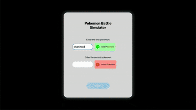

# Pokémon Battle Simulator  
A web-based Pokémon Battle Simulator that fetches real data from the PokéAPI and runs animated, real-time battles.

## Demo  
  

## Usage  
1. Visit the [GitHub Pages link](https://justinr25.github.io/pokemon-battle-simulator/) or open `index.html` in your browser.  
2. Enter two Pokémon names and click **Battle!** to watch them fight using real stats from the PokéAPI.  